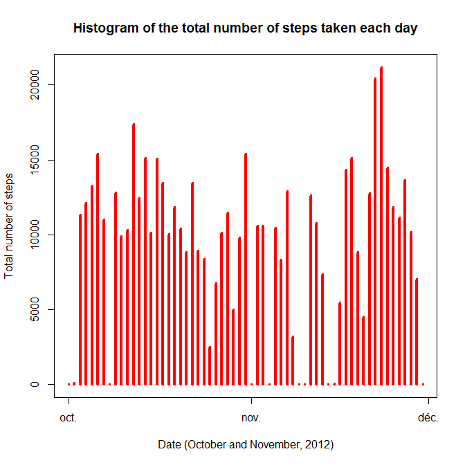
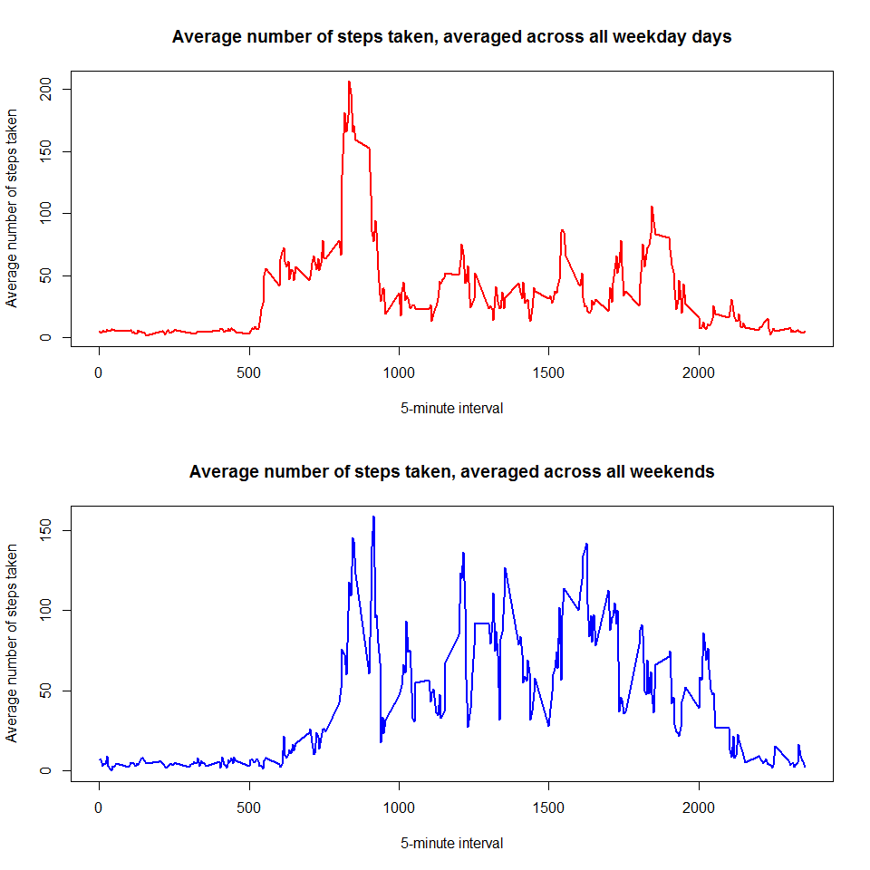

# Reproducible Research: Peer Assessment 1


# Introduction [1]

It is now possible to collect a large amount of data about personal movement using activity monitoring devices such as a Fitbit, Nike Fuelband, or Jawbone Up. These type of devices are part of the "quantified self" movement - a group of enthusiasts who take measurements about themselves regularly to improve their health, to find patterns in their behavior, or because they are tech geeks. But these data remain under-utilized both because the raw data are hard to obtain and there is a lack of statistical methods and software for processing and interpreting the data.


This assignment makes use of data from a personal activity monitoring device. This device collects data at 5 minute intervals through out the day. The data consists of two months of data from an anonymous individual collected during the months of October and November, 2012 and include the number of steps taken in 5 minute intervals each day.


# Data [1]

The data for this assignment can be downloaded from the course web site:

Dataset: Activity monitoring data [52K]
The variables included in this dataset are:

- steps: Number of steps taking in a 5-minute interval (missing values are coded as NA)

- date: The date on which the measurement was taken in YYYY-MM-DD format

- interval: Identifier for the 5-minute interval in which measurement was taken

The dataset is stored in a comma-separated-value (CSV) file and there are a total of 17,568 observations in this dataset.

# Loading and preprocessing the data
This section shows how to load and process data

### 1.Load the data

```r
my_data <- read.csv("activity.csv") # Read in data file
```

### 2.Process/transform the data


```r
# Dates are formatted as YYYY-MM-DD
my_dates <- strptime(my_data$date, "%Y-%m-%d")
my_data$date <- my_dates

# Keep a list of all possible days
my_uniqueDates <- unique(my_dates)
# Keep a list of all possible intervals
my_uniqueIntervals <- unique(my_data$interval)
```


## What is mean total number of steps taken per day?
For this part of the assignment, we ignore the missing values in the dataset.

### 1.Total number of steps taken per day


```r
# Split the data frame by steps
my_stepsSplittedByDay <- split(my_data$steps, my_dates$yday)

# Calculate and show Total number of steps of each day
my_totalStepsByDay <- sapply(my_stepsSplittedByDay, sum, na.rm=TRUE)
head(my_totalStepsByDay) 
```

```
##   274   275   276   277   278   279 
##     0   126 11352 12116 13294 15420
```


### 2.Make a histogram of the total number of steps taken each day

```r
# Plot an histogram where days are presented in x-axis  
# and the total number of steps by day are presented in the y-axis 

plot(my_uniqueDates, my_totalStepsByDay, main="Histogram of the total number of steps taken each day", 
     xlab="Date (October and November, 2012)", ylab="Total number of steps", type="h", lwd=4, col="red")
```

 

### 3. Calculate and report the mean and median of the total number of steps taken per day

#### The mean of the total number of steps taken per day are:

```r
my_meanStepsByDay <- sapply(my_stepsSplittedByDay, mean, na.rm=TRUE)
my_meanDataFrameByDay <- data.frame(date=my_uniqueDates, meanStepsByDay=my_meanStepsByDay, row.names=NULL)
head(my_meanDataFrameByDay)
```

```
##         date meanStepsByDay
## 1 2012-10-01            NaN
## 2 2012-10-02        0.43750
## 3 2012-10-03       39.41667
## 4 2012-10-04       42.06944
## 5 2012-10-05       46.15972
## 6 2012-10-06       53.54167
```

#### The median of the total number of steps taken per day are:

```r
my_medianStepsByDay <- sapply(my_stepsSplittedByDay, median, na.rm=TRUE)
my_medianDataFrameByDay <- data.frame(date=my_uniqueDates, medianStepsByDay=my_medianStepsByDay, row.names=NULL)
head(my_medianDataFrameByDay)
```

```
##         date medianStepsByDay
## 1 2012-10-01               NA
## 2 2012-10-02                0
## 3 2012-10-03                0
## 4 2012-10-04                0
## 5 2012-10-05                0
## 6 2012-10-06                0
```

## What is the average daily activity pattern?

### 1.Make a time series plot (i.e. type = "l") of the 5-minute interval (x-axis) and the average number of steps taken, averaged across all days (y-axis)


```r
# x-axis - the 5-minute interval
# y-axis - the average number of steps taken, averaged across all days

# Splitting data by intervals
my_stepsSplittedByinterval <- split(my_data$steps, my_data$interval)

# The average number of steps taken, averaged across all days
my_averageStepsByInterval <- sapply(my_stepsSplittedByinterval, mean, na.rm=TRUE)

# Plotting the time-series graph with The average number of steps taken
plot(my_uniqueIntervals, my_averageStepsByInterval, type="l",
     main="The average number of steps taken, averaged across all days", 
     xlab="The 5-minute interval", ylab="The average number of steps taken", 
     lwd=2, col="red")

# Find the the maximum
my_maxStepsByDaysInterval <- max(my_averageStepsByInterval, na.rm=TRUE)
my_maxIndex <- as.numeric(which(my_averageStepsByInterval == my_maxStepsByDaysInterval))

# Plot the max with a blue line
my_maxInterval <- my_uniqueIntervals[my_maxIndex]
abline(v=my_maxInterval, col="blue", lwd=3)
```

 


### 2.Which 5-minute interval, on average across all the days in the dataset, contains the maximum number of steps?

```r
result <- paste('Interval max is: ' , my_maxInterval)
result
```

```
## [1] "Interval max is:  835"
```

 


## Imputing missing values
Note that there are a number of days/intervals where there are missing values (coded as NA). The presence of missing days may introduce bias into some calculations or summaries of the data.

### 1. Calculate and report the total number of missing values in the dataset (i.e. the total number of rows with NAs)


```r
my_na <- is.na(my_data$steps)
my_naCount = paste('There is ' , sum(my_na) ,' NAs.')
my_naCount
```

```
## [1] "There is  2304  NAs."
```


### 2. Devise a strategy for filling in all of the missing values in the dataset. The strategy does not need to be sophisticated. For example, you could use the mean/median for that day, or the mean for that 5-minute interval, etc.


```r
# Replace NaN values with 0.  
my_meanStepsByDay[is.nan(my_meanStepsByDay)] <- 0

# Now create a replicated column for mean values and use it to replace columns with NAs values
my_replicatedMeanColumn <- rep(my_meanStepsByDay, length(my_stepsSplittedByinterval) - 1 )


# The steps before replacement
my_Steps <- my_data$steps

# Find any values that are NA in the raw steps data
my_originalStepswithNAs <- is.na(my_Steps)

# Now replace these values with their corresponding mean
my_Steps[my_originalStepswithNAs] <- my_replicatedMeanColumn[my_originalStepswithNAs]
```


### 3. Create a new dataset that is equal to the original dataset but with the missing data filled in.


```r
my_newData <- my_data
my_newData$steps <- my_Steps
head(my_newData)
```

```
##      steps       date interval
## 1  0.00000 2012-10-01        0
## 2  0.43750 2012-10-01        5
## 3 39.41667 2012-10-01       10
## 4 42.06944 2012-10-01       15
## 5 46.15972 2012-10-01       20
## 6 53.54167 2012-10-01       25
```

```r
# Splitting the new data frame for steps by day
my_newStepsSplittedByDay <- split(my_newData$steps, my_dates$yday)

# NCalcul of the total number of steps by each day
my_newTotalStepsSplittedByDay <- sapply(my_newStepsSplittedByDay, sum)
```


### 4.Make a histogram of the total number of steps taken each day and Calculate and report the mean and median total number of steps taken per day. Do these values differ from the estimates from the first part of the assignment? What is the impact of imputing missing data on the estimates of the total daily number of steps?


```r
# Plotting an histogram where days are presented in the x-axis 
# and the total daily number of steps are presented in the y-axis
par(mfcol=c(2,1))

# Plotting the original data without NAs
plot(my_uniqueDates, my_totalStepsByDay, main="Histogram of steps taken each day before imputing NAs", 
     xlab="Date (October and November, 2012)", ylab="Total daily number of steps", type="h", lwd=4, col="red")
# Plot the modified data after imputing NAs
plot(my_uniqueDates, my_newTotalStepsSplittedByDay, main="Histogram of steps taken each day after imputing NAs", 
     xlab="Date (October and November, 2012)", ylab="Total daily number of steps", type="h", lwd=4, col="blue")
```

 


```r
my_newMeanStepsByDay <- sapply(my_newStepsSplittedByDay, mean)
my_newMeanDataFrame <- data.frame(date=my_uniqueDates, meanStepsByDay=my_meanStepsByDay, 
newMeanStepsByDay=my_newMeanStepsByDay, row.names=NULL)
my_newMeanDataFrame
```

```
##          date meanStepsByDay newMeanStepsByDay
## 1  2012-10-01      0.0000000        32.3355276
## 2  2012-10-02      0.4375000         0.4375000
## 3  2012-10-03     39.4166667        39.4166667
## 4  2012-10-04     42.0694444        42.0694444
## 5  2012-10-05     46.1597222        46.1597222
## 6  2012-10-06     53.5416667        53.5416667
## 7  2012-10-07     38.2465278        38.2465278
## 8  2012-10-08      0.0000000        32.2632378
## 9  2012-10-09     44.4826389        44.4826389
## 10 2012-10-10     34.3750000        34.3750000
## 11 2012-10-11     35.7777778        35.7777778
## 12 2012-10-12     60.3541667        60.3541667
## 13 2012-10-13     43.1458333        43.1458333
## 14 2012-10-14     52.4236111        52.4236111
## 15 2012-10-15     35.2048611        35.2048611
## 16 2012-10-16     52.3750000        52.3750000
## 17 2012-10-17     46.7083333        46.7083333
## 18 2012-10-18     34.9166667        34.9166667
## 19 2012-10-19     41.0729167        41.0729167
## 20 2012-10-20     36.0937500        36.0937500
## 21 2012-10-21     30.6284722        30.6284722
## 22 2012-10-22     46.7361111        46.7361111
## 23 2012-10-23     30.9652778        30.9652778
## 24 2012-10-24     29.0104167        29.0104167
## 25 2012-10-25      8.6527778         8.6527778
## 26 2012-10-26     23.5347222        23.5347222
## 27 2012-10-27     35.1354167        35.1354167
## 28 2012-10-28     39.7847222        39.7847222
## 29 2012-10-29     17.4236111        17.4236111
## 30 2012-10-30     34.0937500        34.0937500
## 31 2012-10-31     53.5208333        53.5208333
## 32 2012-11-01      0.0000000        32.0149498
## 33 2012-11-02     36.8055556        36.8055556
## 34 2012-11-03     36.7048611        36.7048611
## 35 2012-11-04      0.0000000        32.4504726
## 36 2012-11-05     36.2465278        36.2465278
## 37 2012-11-06     28.9375000        28.9375000
## 38 2012-11-07     44.7326389        44.7326389
## 39 2012-11-08     11.1770833        11.1770833
## 40 2012-11-09      0.0000000        32.3078945
## 41 2012-11-10      0.0000000        32.8706718
## 42 2012-11-11     43.7777778        43.7777778
## 43 2012-11-12     37.3784722        37.3784722
## 44 2012-11-13     25.4722222        25.4722222
## 45 2012-11-14      0.0000000        32.9865210
## 46 2012-11-15      0.1423611         0.1423611
## 47 2012-11-16     18.8923611        18.8923611
## 48 2012-11-17     49.7881944        49.7881944
## 49 2012-11-18     52.4652778        52.4652778
## 50 2012-11-19     30.6979167        30.6979167
## 51 2012-11-20     15.5277778        15.5277778
## 52 2012-11-21     44.3993056        44.3993056
## 53 2012-11-22     70.9270833        70.9270833
## 54 2012-11-23     73.5902778        73.5902778
## 55 2012-11-24     50.2708333        50.2708333
## 56 2012-11-25     41.0902778        41.0902778
## 57 2012-11-26     38.7569444        38.7569444
## 58 2012-11-27     47.3819444        47.3819444
## 59 2012-11-28     35.3576389        35.3576389
## 60 2012-11-29     24.4687500        24.4687500
## 61 2012-11-30      0.0000000                NA
```


if we use median values, we have:


```r
my_newMedianStepsByDay <- sapply(my_newStepsSplittedByDay, median)
my_newMedianDataFrame <- data.frame(date=my_uniqueDates, meanStepsByDay=my_medianStepsByDay, 
newMedianStepsByDay=my_newMedianStepsByDay, row.names=NULL)
head(my_newMedianDataFrame)
```

```
##         date meanStepsByDay newMedianStepsByDay
## 1 2012-10-01             NA            36.09375
## 2 2012-10-02              0             0.00000
## 3 2012-10-03              0             0.00000
## 4 2012-10-04              0             0.00000
## 5 2012-10-05              0             0.00000
## 6 2012-10-06              0             0.00000
```


## Are there differences in activity patterns between weekdays and weekends?

We use the dataset with the filled-in missing values for this part.


### 1.Create a new factor variable in the dataset with two levels for weekdays and for weekends€ indicating whether a given date is a weekday or weekend day.

```r
# Splitting data by week and weekend days
my_weekDays <- my_dates$wday

# Setting a new column variable to 1 if weekdaus and to 2 if weekend days
my_weekdaysClassification <- rep(0, length(my_weekDays)-1) # 17568 observations overall
my_weekdaysClassification[my_weekDays >= 1 & my_weekDays <= 5] <- 1
my_weekdaysClassification[my_weekDays == 6 | my_weekDays == 0] <- 2

# Setting a new factor variable labelled "Weekdays"" and "Weekends""
my_daysFactor <- factor(my_weekdaysClassification, levels=c(1,2), labels=c("Weekdays", "Weekends"))

# Creatting a column for this factor
my_newData$typeOfDay <- my_daysFactor

# Now split up into two data frames
my_newWeekdaysData <- my_newData[my_newData$typeOfDay == "Weekdays", ]
my_newWeekendsData <- my_newData[my_newData$typeOfDay == "Weekends", ]
```


### 2.Make a panel plot containing a time series plot (i.e. type = "l") of the 5-minute interval (x-axis) and the average number of steps taken, averaged across all weekday days or weekend days (y-axis). See the README file in the GitHub repository to see an example of what this plot should look like using simulated data.


```r
# Further split up the Weekdays and Weekends into their own intervals
myDataForWeekdaysSplittedByInterval <- split(my_newWeekdaysData$steps, my_newWeekdaysData$interval)
myDataForWeekendsSplittedByInterval <- split(my_newWeekendsData$steps, my_newWeekendsData$interval)

# Calculus of average steps by interval
myMeanForWeekdaysSplittedByInterval <- sapply(myDataForWeekdaysSplittedByInterval, mean)
myMeanForWeekendsSplittedByInterval <- sapply(myDataForWeekendsSplittedByInterval, mean)

# Plotting average of steps by interval for weekdays 
par(mfcol=c(2,1))
plot(my_uniqueIntervals, myMeanForWeekdaysSplittedByInterval, type="l", main="Average number of steps taken, averaged across all weekday days", xlab="5-minute interval", ylab="Average number of steps taken", lwd=2, col="red")

# Plotting average of steps by interval for weekends
plot(my_uniqueIntervals, myMeanForWeekendsSplittedByInterval, type="l",
main="Average number of steps taken, averaged across all weekends", 
xlab="5-minute interval", ylab="Average number of steps taken", 
lwd=2, col="blue")
```

 


